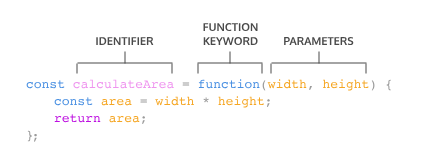

## If Else


### Ternary operator

```js
// If Else
if (day === 'Wednesday') {
    return true;
  } else {
    return false;
  }

// Ternary operator
day === 'Wednesday' ? true : false;
```


## String methods

| Method | Description |
| - | - |
| `.split(' ')` | Returns array of words |
| `.join(' ')` | Returns a string with spaces |

## Javascript functions

### Function expressions

Another way to define a function is to use a function expression. To define a function inside an expression, we can use the function keyword. In a function expression, the function name is usually omitted. A function with no name is called an anonymous function. A function expression is often stored in a variable in order to refer to it.



```js
const plantNeedsWater = function(day) {
  if (day === 'Wednesday') {
    return true;
  } else {
    return false;
  }
};


console.log(plantNeedsWater('Tuesday'));
```

### Arrow functions

ES6 introduced arrow function syntax, a shorter way to write functions by using the special “fat arrow” () => notation.

Arrow functions remove the need to type out the keyword function every time you need to create a function. Instead, you first include the parameters inside the ( ) and then add an arrow => that points to the function body surrounded in { } like this:

```
const rectangleArea = (width, height) => {
  let area = width * height;
  return area;
};
```

#### Concise AF syntax

```js
// Zero parameters
const functionName = () => {}; // Brackets only if multiline function

// One parameter
const functionName = paramOne => {};

// Two parameters
const functionName = (paramOne, paramTwo) => {};
```

## Arrays

| METHOD | CODE | DESCRIPTION |
|-|-|-|
| push | `varArray.push('item1', 'item2');` | Appends elements to an array |
| pop | `varArray.pop();` | Deletes last item of the list |
| shift | `varArray.shift();` | Deletes first item of the list |
| unshift | `varArray.shift();` | Adds an element first of the list |
| slice | `varArray.slice(1, 3);` | Slice a list of elements by index |
| indexOf | `varArray.indexOf('item5);` | Returns the index of the element provided |


## Iterators

### The `.forEach()` Method`

The first iteration method that we’re going to learn is .forEach(). Aptly named, .forEach() will execute the same code for each element of an array.

```js
const groceries = ['mango', 'papaya', 'pineapple', 'apple'];

fruits.forEach(function announcement(item){
  console.log(`I want to eat a ${item}`);
});
```

Another way to pass a callback for .forEach() is to use arrow function syntax.

```js
groceries.forEach(groceryItem => console.log(groceryItem));
```

We can also define a function beforehand to be used as the callback function.

```js
function printGrocery(element){
  console.log(element);
}

groceries.forEach(printGrocery);
```


## The `.map()` Method

The second iterator we’re going to cover is .map(). When .map() is called on an array, it takes an argument of a callback function and returns a new array! Take a look at an example of calling .map():`

```js
const numbers = [1, 2, 3, 4, 5]; 

const bigNumbers = numbers.map(number => {
  return number * 10;
});
```

`.map()` works in a similar manner to .forEach()— the major difference is that .map() returns a new array.`


## The `.filter()` Method

Another useful iterator method is .filter(). Like .map(), .filter() returns a new array. However, .filter() returns an array of elements after filtering out certain elements from the original array. The callback function for the .filter() method should return true or false depending on the element that is passed to it.

```js
const words = ['chair', 'music', 'pillow', 'brick', 'pen', 'door']; 

const shortWords = words.filter(word => {
  return word.length < 6;
});
```

## The `.findIndex()` Method

We sometimes want to find the location of an element in an array. That’s where the .findIndex() method comes in! Calling .findIndex() on an array will return the index of the first element that evaluates to true in the callback function.


```js
const jumbledNums = [123, 25, 78, 5, 9]; 

const lessThanTen = jumbledNums.findIndex(num => {
  return num < 10;
});
```


## The `.reduce()` Method

Another widely used iteration method is .reduce(). The .reduce() method returns a single value after iterating through the elements of an array, thereby reducing the array. Take a look at the example below:

```js
const numbers = [1, 2, 4, 10];

const summedNums = numbers.reduce((accumulator, currentValue) => {
  return accumulator + currentValue
}, 0)

console.log(summedNums) // Output: 17
```

The .reduce() method can also take an optional second parameter to set an initial value for accumulator (remember, the first argument is the callback function!).


## The `.some()` Method

The `.some()` method checks if at least one element in the array passes the test implemented by the provided function. It returns a Boolean value - true if at least one element satisfies the condition, and false otherwise. This method is useful for scenarios where you need to determine the presence of any element that meets certain criteria.

```js
const words = ['unique', 'uncanny', 'pique', 'oxymoron', 'guise'];

console.log(words.some(word => {
  return word.length < 6;
}));
```


## The `.every()` Method

The `.every()` method checks if all elements in an array pass the test implemented by the provided function. It returns a Boolean value - true if all elements satisfy the condition, and false otherwise. This method is useful when you need to ensure that all elements in an array meet certain criteria.

```js
const words = ['unique', 'uncanny', 'oxymoron'];

console.log(interestingWords.every((word) => {
  return word.length > 5;
} ));
```